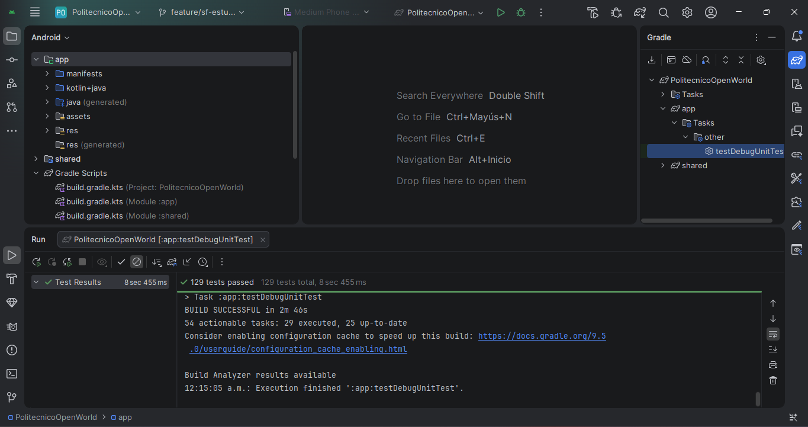

# Primer examen parcial — PR con aseguramiento de calidad

**Unidad de aprendizaje:** Desarrollo de aplicaciones móviles nativas · **Grupo:** 7CV4 · **Periodo:** 2027-1

## Equipo
| Integrante | Usuario de GitHub | PR |
|---|---|---|
| Lupita Alvirde | @hernandezalvirdemariaguadalupe-cyber | gabrielhuav/PolitecnicoOpenWorld#164 |
| Aragón Martínez Manuel Alejandro | @ManuelAAM | gabrielhuav/PolitecnicoOpenWorld#174 |

## Objetivo y alcance
Agregar al modo **Titulación por Combate** un peleador nuevo, **"Estudiante IPN"**, reutilizando los sprites existentes del NPC de interiores `Ipn3`, seleccionable solo con Developer Mode.
**Fuera de alcance:** arcade y desbloqueos, arte nuevo, voces, IA propia.

## Referencias del cambio
| Concepto | Valor |
|---|---|
| Issue | gabrielhuav/PolitecnicoOpenWorld#163 |
| Pull Request | gabrielhuav/PolitecnicoOpenWorld#164 |
| Rama | `feature/sf-estudiante-ipn-fighter` |
| SHA base | `7ed325393f82872c2be94ff2ada46948efa19152` |
| SHA final entregado | `5e3504d1` (completo: `git rev-parse HEAD`) |

## Matriz de pruebas y evidencias
- [Plan, riesgos, casos y hallazgos](docs/pruebas.md)
- [Evidencias](evidencias/)

## Checks (CI)
| Check | Estado | SHA / ejecución | Registro |
|---|---|---|---|
| PR Quality Gate (run #154: unit-tests + detekt) | ⚠️ Bloqueado — *Action required*: esperando aprobación del mantenedor ("Workflow runs completed with no jobs") | `5e3504d1` | [Actions](https://github.com/gabrielhuav/PolitecnicoOpenWorld/actions?query=branch%3Afeature%2Fsf-estudiante-ipn-fighter) |

**Bloqueo externo:** GitHub retiene los workflows de PR desde forks de colaboradores nuevos hasta que el mantenedor los aprueba. No se desactivó ni modificó ningún check.
**Validación local equivalente:** `:app:testDebugUnitTest` → 132/132 en `5e3504d1` y `:shared:testAndroidHostTest` en verde (Android Studio). 

**Qué comprueban:** build debug de Android, pruebas unitarias de `app` y `shared`, nombres de prueba compatibles con Kotlin/Native y análisis estático con detekt.
**Qué queda fuera:** CI usa `MAPS_API_KEY` vacío y no tiene `google-services.json` (mapas y Firebase no se prueban); no ejecuta la app ni pruebas de UI, por eso se hizo QA manual.

## Revisión técnica
- **Revisión recibida de:** Aragón Martínez Manuel Alejandro ([@ManuelAAM](https://github.com/ManuelAAM)) — [Comentario de Aprobación en PR #164](https://github.com/gabrielhuav/PolitecnicoOpenWorld/pull/164)
- **Revisión hecha por mí al PR de:** Aragón Martínez Manuel Alejandro ([@ManuelAAM](https://github.com/ManuelAAM)) — [Comentario de Aprobación en PR #174](https://github.com/gabrielhuav/PolitecnicoOpenWorld/pull/174#pullrequestreview-538538443)

### Evidencia de Validación Local por Revisor (@ManuelAAM)
- **Dispositivo de prueba:** Samsung Galaxy A54 5G (SM-A546E, Android 14) / AVD API 36.
- **Casos verificados:** C01 (Ruta Feliz en selector y combate en ESCOM), C02 (Condición límite con Developer Mode OFF), y D1 (Escala y proporciones correctas de sprite compartido en `SfSceneRenderer.kt`).

| Selector con Developer Mode ON | Pelea en ESCOM (Sprites Proporcionales) |
|:---:|:---:|
|  |  |

## Conclusiones
Se agregó el peleador "Estudiante IPN" reutilizando sprites existentes, solo con Developer Mode. Durante el QA se encontró el defecto D1 (los peleadores compartidos se dibujaban gigantes en gama baja), preexistente en el renderer; se corrigió en un commit aparte con prueba de regresión y se volvió a probar. Los casos C01–C06 se aprobaron y las pruebas unitarias pasan 132/132. Recomiendo integrar el cambio; quedan como riesgos las poses alpha aproximadas, la falta de validación con TalkBack y el CI pendiente de aprobación.

## Bitácora
- [Bitácora de Lupita Alvirde](docs/bitacora-lupita.md)

## Referencias
- README de POW y `.github/workflows/pr-quality-gate.yml` del repositorio original (revisados el 2026-09-28).
- Material del curso: prácticas 1 a 3, Entrega 1 del Proyecto.
